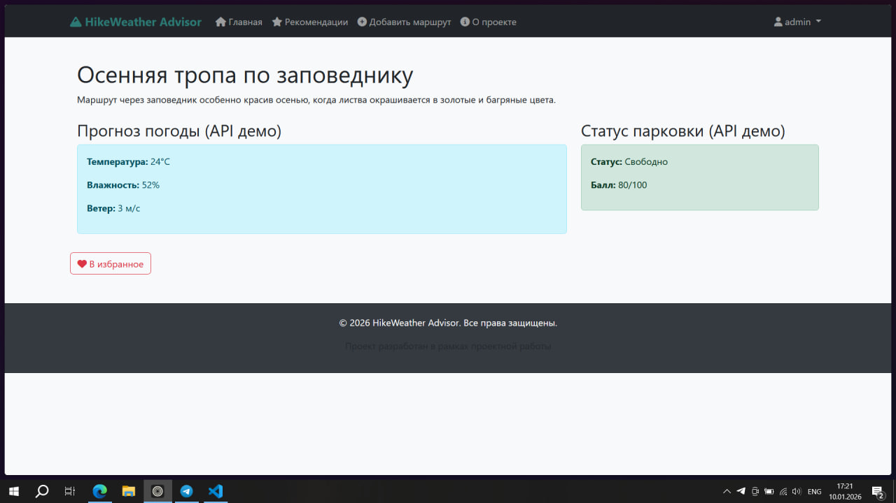
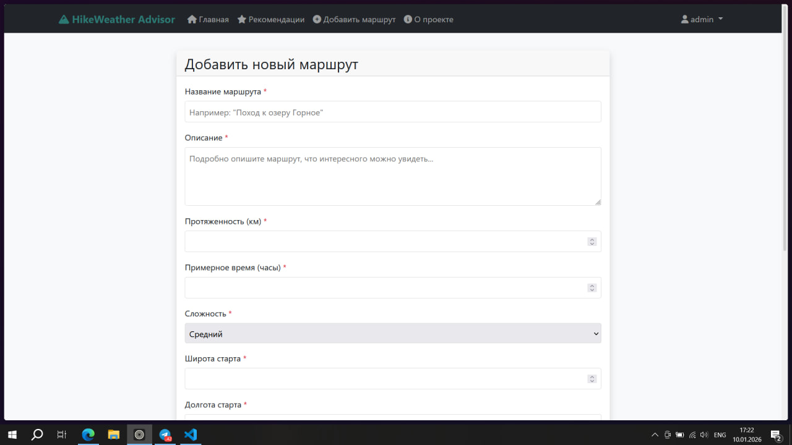

# HikeWeather Advisor 🌤️🥾

**Умный планировщик пеших походов с учётом погоды и доступности парковок**

HikeWeather Advisor — это веб-приложение для любителей активного отдыха, которое помогает планировать идеальные пешие маршруты. Система анализирует погодные условия, доступность парковок у начала маршрута и сложность треков, предоставляя комплексную оценку и рекомендации в реальном времени.

**Ссылка на рабочий проект:** []

## 🛠️ Технологии
* **Python 3.14.2** (совместимо с 3.10+)
* **Django 4.2.7** — веб-фреймворк
* **Bootstrap 5** — CSS-фреймворк для адаптивного дизайна
* **SQLite** — база данных для разработки (легко мигрируется на PostgreSQL)
* **Chart.js** — для визуализации погодных данных
* **Font Awesome** — иконки для улучшения UX

## 📸 Скриншоты

### 🏠 Главная страница

*Список всех маршрутов с фильтрацией по сложности и поиском*

### 📊 Детали маршрута

*Подробная информация о маршруте: погода, парковка, отзывы и рекомендации*

### 🗺️ Форма добавления маршрута

*Интуитивная форма для добавления новых пеших маршрутов*

## 🚀 Как запустить проект локально

1. **Клонируйте репозиторий**
```bash
git clone https://github.com/Pupazalupka/project.git
cd project
```

2. **Создайте виртуальное окружение**
```bash
python -m venv venv
source venv/bin/activate  # для Linux/Mac
venv\Scripts\activate     # для Windows
```
3. **Установите зависимости:**
```bash
pip install -r requirements.txt
```
4. **Выполните миграции:**
```bash
python manage.py migrate
```
5. **Запустите сервер:**
```bash
python manage.py runserver
 ```
6. **Откройте проект в браузере:**
Перейдите по ссылке: http://127.0.0.1:8000/